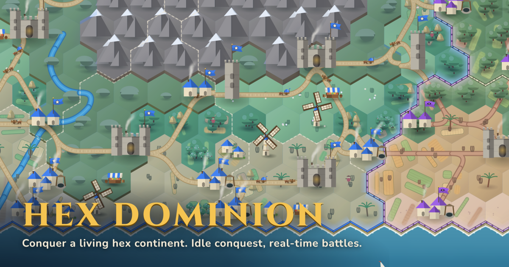
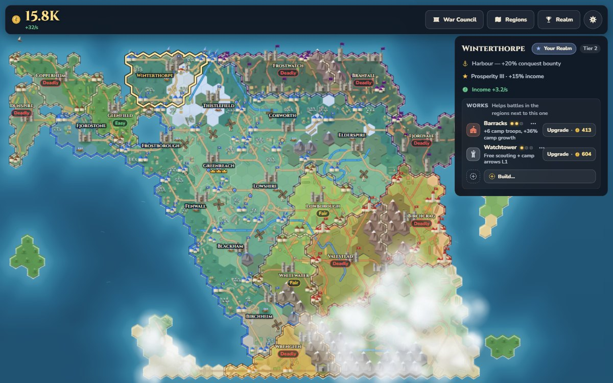
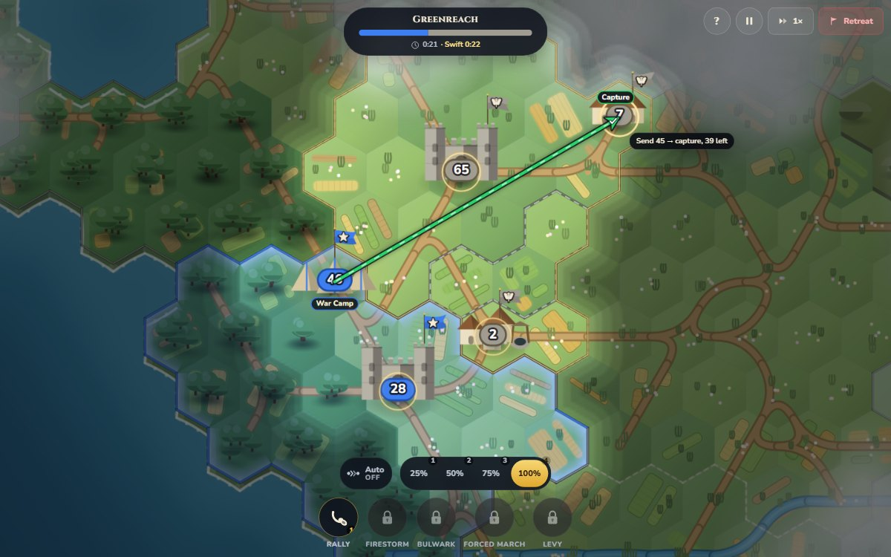

# Hex Dominion

[](https://ka1e27.github.io/temp/)

Idle conquest on a living, procedurally generated hex continent. Your banner holds one small
corner under drifting clouds. Every region you conquer pays you gold forever, even while you are
away, and that gold buys the upgrades and battle powers that crack the next, harder region.
Battles are fast (about a minute, rarely more than three), fought on the map itself, and fully deterministic: drag armies
between settlements, intercept marches in the field, call down fire, take the enemy keep. Conquer
the whole continent, then found a dynasty and do it again on a new world.

**Play it: https://ka1e27.github.io/temp/** (desktop or phone, nothing to install). The original
v1 game is still here as [`classic.html`](https://ka1e27.github.io/temp/classic.html).

Static site, vanilla ES modules, zero dependencies, no build step.

| The realm | A battle |
|---|---|
|  |  |

## How to play

The world map is the game. Tap or click a region next to yours to open its card: your chance of
winning it, in words ("about 1 in 5", with the Easy / Fair / Hard / Deadly label and the two power
numbers beside it), its perk, its income and the **Attack** button. Win the battle and the region
floods with your colour and starts paying. The **Regions** button lists every region you can see,
the ones you can attack first, so the whole game can be played from a list too.

| | Mouse and keyboard | Touch |
|---|---|---|
| Move the map | drag | drag |
| Zoom | wheel | pinch (two fingers also pan) |
| Open a region | click it | tap it |
| Send troops (battle) | drag from one of your settlements to any settlement | drag from a settlement to a target |
| Send from several | click your settlements, then click a target; shift-drag lassos; `A` selects all | tap your settlements, then tap a target |
| Share of the garrison sent | HUD buttons or keys `1` `2` `3` `4` (25 / 50 / 75 / 100 %) | HUD buttons |
| Battle powers | HUD buttons or `Q` `W` `E` `R` `T` | HUD buttons |
| Clear selection, close a panel | `Esc` or right-click | tap the close button |
| Pause, speed | `Space`, HUD 1x / 2x / 3x (0.5x too with Settings > Slow battles) | HUD buttons |
| Supply line (a standing order) | `Ctrl`-drag, or switch on **Auto** (`S`) and plain drags make them; repeat it to end it; right-click the source removes it | long-press then drag, or **Auto** |
| Mute | `M` | Settings |
| **Play with the keyboard alone** | `Tab` to the map, arrow keys move a ring between regions (or, in a battle, settlements), `Enter` opens a region / selects a settlement / sends, `[` `]` cycle the regions you can attack, `+` `-` zoom, `Shift`+arrows pan | |

Sending to one of your own settlements reinforces it. Retreat is always available and costs nothing
but the attempt. `?dev=1` on the URL opens a developer panel (grant gold, win or lose a battle,
reseed).

### Playing without a mouse, or without seeing the colours

The whole game, from New Realm to a conquest, plays from the keyboard (the map and the battle each
have an arrow-key cursor, and everything it lands on is read out), and every control has a name for a
screen reader. Panels are real dialogs (focus moves in, Tab stays inside, `Esc` closes, focus returns).
Reduce Motion follows your system setting and cuts every camera flight and animation. The five factions
stay apart for red-green and blue-yellow colour blindness (a test checks every pair) and each has its
own emblem; the send arrow tells you what will happen by shape too (solid with a check: captured,
dashed with a cross: not enough troops, dotted: no route). Touch targets are at least 44 px; interface text on phones is at least 12 px (map chips and power
names at least 11 px).

## Features

- **A living continent.** Generated from a seed: rivers, lakes, mountains, coasts, roads and about 27
  regions split between you, the Free Folk and three rival factions. Regions you have not reached lie
  under fog. Caravans roll along the roads, chimneys smoke, windmill sails turn, boats sail off
  harbour regions and the odd flock of birds crosses the view.
- **Fast deterministic battles.** One troop type, settlements, terrain, towers and interception; no
  dice. Five powers (Rally, Firestorm, Bulwark, Forced March, Levy) bought and levelled in the War
  Council. The timer counts down to the Swift crown, and orders given while paused wait for the resume.
- **Front lines.** Troops march only through their own side's land (and neutral land), so you take the
  near settlements to open a path to the keep; the same rule binds the enemy. A short neutral strip opens
  a first target where the border would otherwise leave none, and a mountain pass is drawn as a road
  across the peaks where troops may cross a ridge. A send with no route says so and shakes.
- **Supply lines.** A standing order from one of your settlements: it keeps sending troops to its target on
  its own, so a battle becomes setting up flows and reacting. Create them with Ctrl-drag, a long-press, or the
  Auto switch; repeat the gesture to end one.
- **Region Works.** Every region you hold has building slots (more as it prospers). Gold builds and levels Barracks,
  Stables, Shrines, Watchtowers and Markets there: the first four help the battles in the regions next to it (a
  bigger, faster-growing War Camp, faster marching and supply lines, shorter power cooldowns, free scouting and a
  camp that shoots arrows), a Market pays more income. Where you build is a decision; you can demolish for half back.
- **Crowns.** A win can earn up to three: Victory, Swift (under the region's par time) and Unbroken
  (no settlement you started the battle with is captured). Each adds 25 % of the region's bounty;
  owned regions show crown pips on their label.
- **Rival leaders.** Each faction has a seeded-name leader who speaks a short line at key moments:
  first contact, battle start, their keep under assault, their defeat, your defeat.
- **Win chance.** A region's card shows your chance of winning in words, calibrated against the real AI, so a
  Deadly region never looks like a close fight.
- **Scout and Sabotage.** Two gold actions on a frontier region: Scout reveals its settlements,
  leader and a suggested weak point; Sabotage (up to twice, after scouting) cuts its starting
  garrisons by 15 % each time.
- **Prosperity.** Regions you hold grow prosperous with real time, including while you are away
  (30 minutes, 2 hours, 8 hours: +5, +10, +15 % of that region's income). You can see it on the map:
  windmills, paved roads, orchards, market awnings.
- **Idle income.** Gold accrues per second from every region, also offline: up to two hours of income
  while you are away to begin with, more with the Treasury upgrade, and a welcome-back card when you
  return. A first continent is tuned to take on the order of an hour and a half of play; then you can
  found a dynasty: a new continent with tougher enemies and permanent stars (+3 % income and +3 % bounty each).
- **Keepsakes.** Your realm keeps a **Chronicle** of its story (the first banner, a toppled capital, a triple crown, a
  new record, the whole continent, a new dynasty) in the Realm panel, and **Save the map** turns the continent into a
  woven Tapestry picture to keep, also offered just before you found a dynasty and the map resets.
- **Music and sound.** The score and every sound effect are synthesised with WebAudio at run time
  (no audio files); the music follows the state of the battle. Music and sound each have a toggle and a
  volume slider in Settings (`M` mutes).
- **Installable and offline.** A PWA with a service worker: after one visit the game reloads with the
  network switched off. The save lives in `localStorage` (autosaved, an in-progress battle included)
  and can be exported and imported from Settings.

## Run it locally

```bash
npm start                  # static dev server -> http://localhost:8080/
```

ES modules cannot load from `file://`, so opening `index.html` directly will not work. Any static
server does (`python3 -m http.server 8080`). Everything is relative-pathed because the site lives
under `/temp/` on GitHub Pages.

## Develop

```bash
npm test                   # node --test "game/tests/**/*.test.js"; no browser needed
npm run world -- --seed=7  # ASCII world preview and stats
npm run balance            # headless battle harness (difficulty labels against the real AI)
npm run shots              # screenshot tour of the running game (needs npm start)
```

The browser tools drive a real headless Chrome through `tools/cdp.js` (DevTools protocol, no
dependencies). Set `CHROME_PATH` if Chrome is not found (`C:/Program Files/Google/Chrome/Application/chrome.exe`
is the default on Windows).

| Tool | What it does |
|---|---|
| `node tools/check.mjs` | The smoke gate. Boots the real game, then drives it with real pointer and touch events at 1440x900 and 390x844: New Realm, a region card, Attack, a drag-send, a win, Continue, a reload with the save intact. Then the robustness scenarios (an unattackable region, a stale welcome, two tabs sharing one save, an unresumable saved battle), Keepsakes (the Chronicle, Save the map, a new dynasty) and the first hints on desktop, phone and a phone on its side. Fails on any failed check or console error. `--only=desktop\|phone\|robust\|keepsakes\|playtest\|deploy` runs one part. Needs `npm start`. |
| `node tools/a11ycheck.mjs` | Accessibility with real input and the browser's own accessibility tree: no unnamed controls, dialogs trap and restore focus, 44 px touch targets on a phone, Reduce Motion under `prefers-reduced-motion`, and the **whole game played from the keyboard** (New Realm to a conquest). |
| `node tools/hints.mjs` | Tutorial hint placement at seven viewports, measured after every frame: a hint never covers its target or a number you are deciding on, never takes a click, stays on screen. Exits 1 on a miss. |
| `node tools/iconcheck.mjs` | Icon-only buttons: the icon centred within 1 px of its button, inside its bar, and touch hit areas of at least 44 px. |
| `node tools/gallery/works-check.mjs`, `node tools/gallery/keepsakes-check.mjs` | The Region Works and Keepsakes component galleries, checked in a real browser. |
| `node tools/rc2shots.mjs [--variant=desktop\|phone\|both]` | Re-shoots the release gallery into `screenshots/game/rc2-*.png`: title, first screen with the outlined region, the tutorial battle with the shape arrow, the victory crowns, a mid-game realm with Works, the Regions list, a scouted card, the Realm panel with the Chronicle and a Tapestry. |
| `node tools/check.mjs --base=temp` | The deployed shape: serves the repo under a `/temp/` subpath with nothing at `/` (like Pages), registers the service worker and adds the deploy checks (no 404s, MIME types, manifest and icon sizes, `classic.html` loads, a reload with the network off). It starts its own server. In Git Bash write `temp`, not `/temp/` (MSYS rewrites the latter). |
| `node tools/shots.mjs [--only=desktop\|phone\|battle\|hook\|intel\|living]` | Screenshot tour of the real game into `screenshots/game/` (git-ignored). `tools/supplyshots.mjs` photographs the supply-line and front-line UI. |
| `node tools/docshots.mjs` | Retakes this README's two images (`docs/img/realm.jpg`, `docs/img/battle.jpg`) from the real game. |
| `node tools/playtest.mjs --variant=desktop\|phone` | A first-session playtest as a brand-new player using real input; prints a timeline of panels, overlaps and clipped text. Meant to be read, not a pass/fail gate. |
| `node tools/launch-assets.mjs` | Regenerates `og.png` and the app icons from the live renderer (see below). |

Other scripts in `tools/` are documented in their headers: `campaign.mjs` (a headless virtual player
for a whole continent), `musicrender.mjs` (renders the score to WAV and measures it) and
`gallery/*.html` (dev galleries for art, UI, effects, music and the living map, served by `npm start`).

### Launch assets

`og.png` (1200x630), `icon-192.png`, `icon-512.png`, `icon-maskable-512.png`, `apple-touch-icon.png`,
`favicon-32.png` and `favicon.svg` are not drawn separately: `tools/launch-assets.mjs` renders them with
the game's own renderer in headless Chrome (the tile, keep, banner and sea functions for the icon; a
real frame of a prosperous realm for the social card).

```bash
node tools/launch-assets.mjs                       # everything, into the repo root
node tools/launch-assets.mjs --only=icons          # or --only=og [--seed=6 --zoom=46]
node tools/launch-assets.mjs --out=some/dir --preview=some/dir   # write elsewhere, plus contact sheets
```

## Where things are

- `docs/DESIGN.md`: what the game is and why (source of truth for gameplay and art).
- `docs/ARCHITECTURE.md`: module layout, data contracts, rules (source of truth for code).
- `docs/INTEGRATION-NOTES.md`, `docs/MUSIC.md`, `docs/PLAYFEEL.md`: implementation notes per area.
- `game/`: the game. `game/core`, `game/world`, `game/battle` and `game/meta` are pure (no DOM, no
  clock, no `Math.random`) so the simulation runs identically in Node and the browser.
- `src/`, `tests/`, `classic.html`: the v1 game (tag `v1-final`), kept for reference and as the
  classic link. Nothing in `game/` imports from it.
